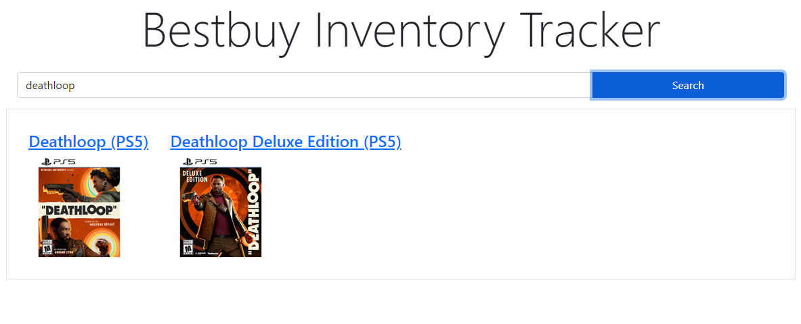

# Bestbuy Iventory Tracker
### Bestbuy Inventory tracker App Built with React, Bootstrap and Node.js. Hosted on Firebase

### Try it [here](https://inventory-tracker-5527a.web.app/)

React app is routed to '/'.

Search API is routed to '/api/search/:productName'

# Current Progress:

# TODO:
### Node server
 - Complete endpoint for /availability/:sku

### React front end
 - Used data from node server and display online inventory status

### Firebase backend

# Milestones:
 1. Stock tracker can search, display product and current stock for both online and nearby stores
 1. Users can enter email and get notifications when item is in-stock.
 1. Stock tracker can search, display product and current stock for nearby stores
 1. Make it more stylish 😎

# History (in Reverse chronological order):
 - Setup a node server to get real data from bestbuy API (CORS prevents fetch() from getting data through react app
 - Setup firebase for React app and node server API
 - Boiler plate node server for API
 - Developed template React app 